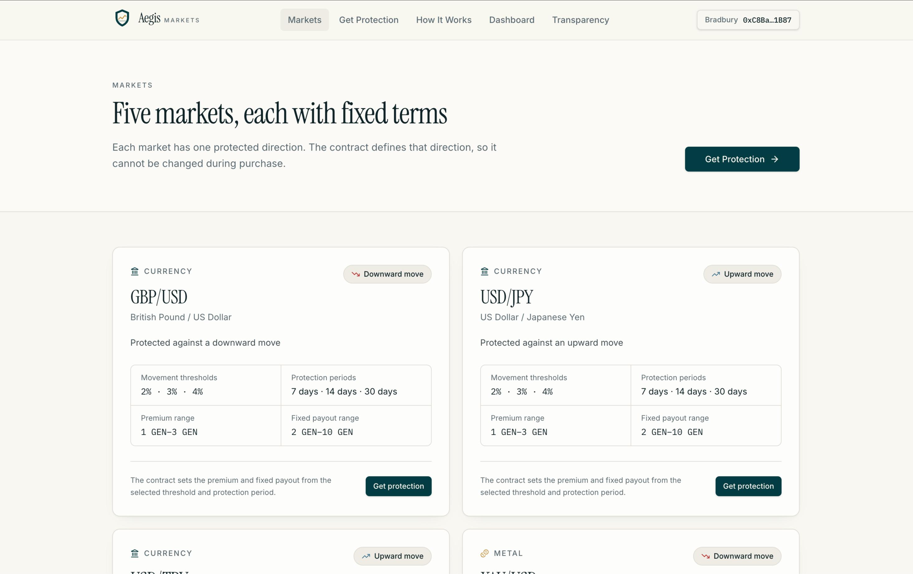
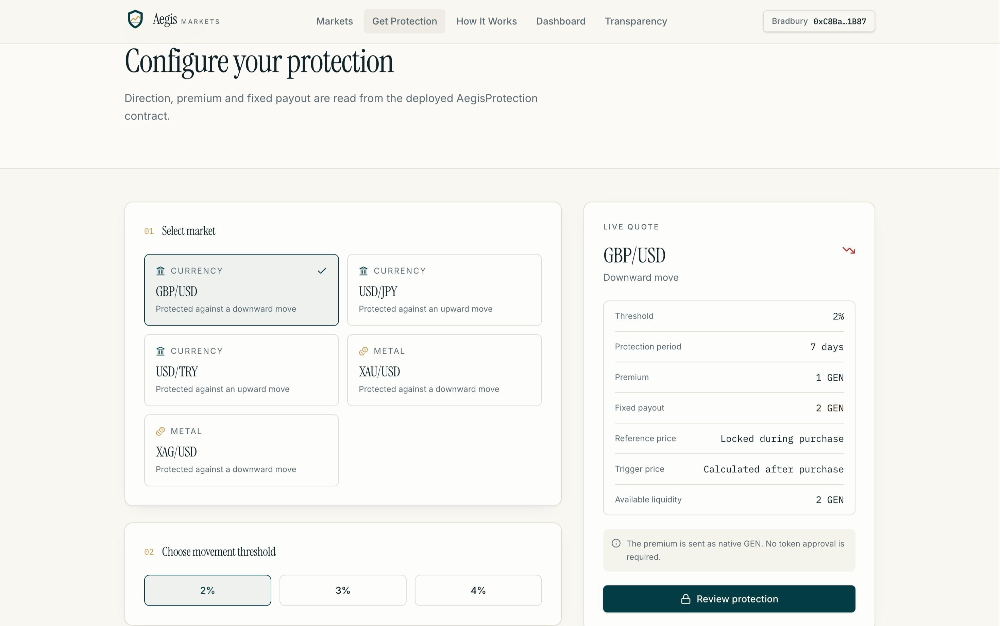
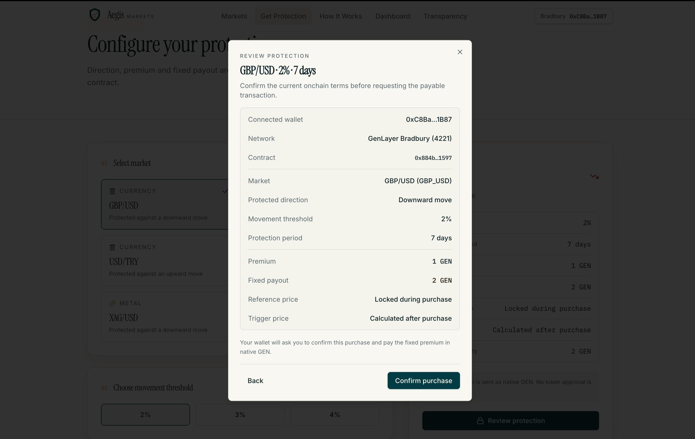
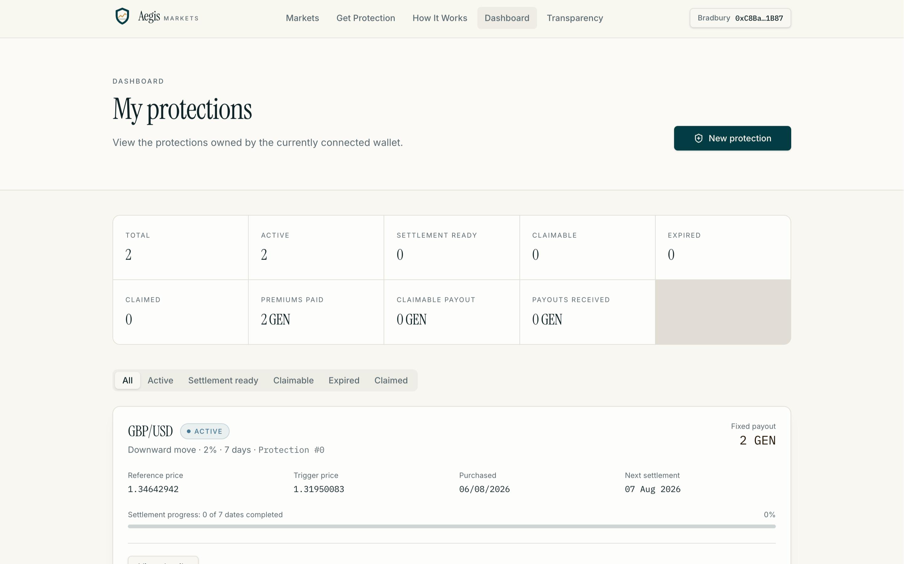
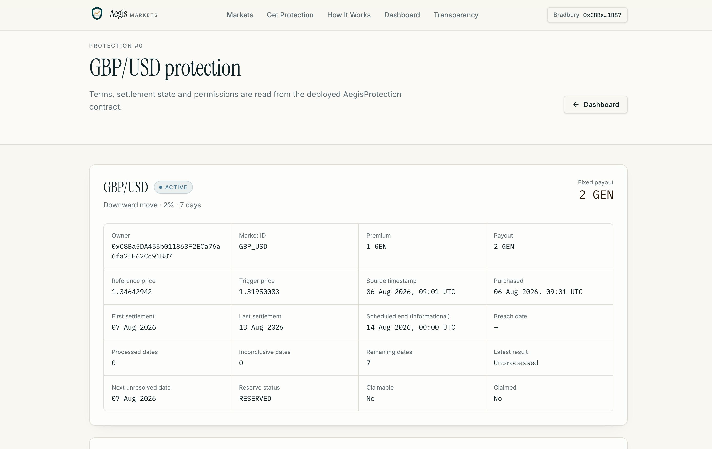
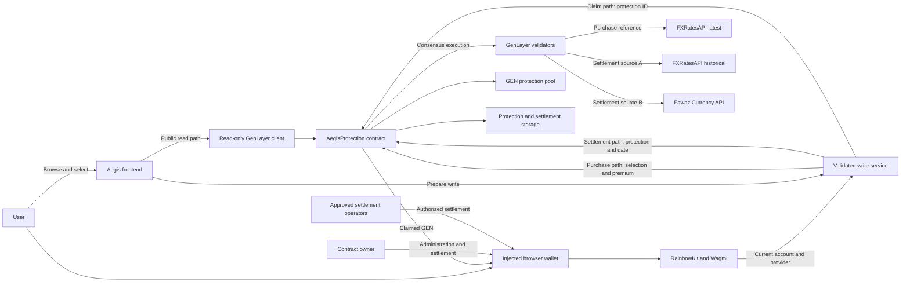
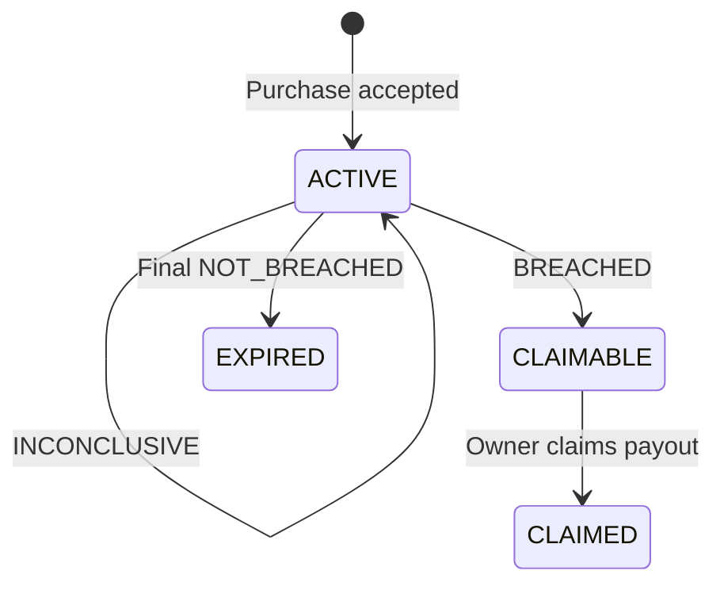

# Aegis Markets

> **Aegis Markets gives traders simple, fixed-payout protection against major moves in currencies and precious metals. Choose what you want to protect, select the size and duration of the move, pay a fixed GEN premium, and claim a predefined payout when independent market data confirms the trigger.**

> **No leverage. No liquidations. Clear terms before purchase.**

| Deployment       | Current value                                                                                                                             |
| ---------------- | ----------------------------------------------------------------------------------------------------------------------------------------- |
| Network          | GenLayer Bradbury                                                                                                                         |
| Contract         | [`0xe44E5B93baCF3da55840b452D5274e175214C19D`](https://explorer-bradbury.genlayer.com/address/0xe44E5B93baCF3da55840b452D5274e175214C19D) |
| Wallets          | Installed EVM-compatible browser wallets                                                                                                  |
| Contract version | `1.0.0`                                                                                                                                   |

## What Aegis Does

A buyer chooses one of five supported markets, a `2%`, `3%`, or `4%` movement threshold,
and a protection period of `7`, `14`, or `30` days. The contract returns the fixed premium
and fixed payout for that combination. The premium is paid in native GEN.

During purchase, the contract obtains and stores a live reference price. It then calculates
the trigger price from that reference and the market's fixed direction. These prices are
supposed to differ: for downward `2%` protection, the trigger is the reference price minus
`2%`; for upward `2%` protection, it is the reference price plus `2%`.

Eligible dates can then be settled against historical market data. A confirmed breach makes
the protection claimable, and only its owner can claim the predefined payout.

## How It Works

1. Choose a market.
2. Select a movement threshold.
3. Select a protection period.
4. Review the fixed premium and payout returned by the contract.
5. Confirm the purchase in an injected browser wallet.
6. Settle eligible dates as they become ready.
7. Claim the fixed payout if the trigger is confirmed.

Settlement is user-initiated: the contract does not wake itself up or submit daily
transactions. A protection owner can settle their own protection. The contract owner and up
to five approved operators can settle any protection. If several dates were missed, the
oldest unresolved date must be handled first, one date at a time.

## UI Tour

### Explore supported markets

View the currency and precious-metal markets currently supported by the deployed Aegis
contract, including each market’s fixed protected direction.



### Configure protection

Choose a market, movement threshold, and protection period. Premium, fixed payout, and
available liquidity are read directly from the deployed contract.



### Review the purchase

Review the selected market, direction, threshold, duration, premium, payout, connected wallet,
network, and deployed contract before confirming the purchase.



### Track protections

The dashboard summarizes the connected wallet’s active, claimable, claimed, and expired
protections using live contract data.



### Settle or claim

The protection detail page shows the locked reference price, calculated trigger price,
settlement history, next unresolved date, and the action currently available to the owner.



## Why Aegis Uses GenLayer

The outcome depends on facts that exist outside the contract. A purchase needs a current
market reference, while settlement needs historical prices for a specific date. A normal
deterministic contract cannot independently fetch and verify those facts.

GenLayer validators execute the configured web reads independently and check the evidence
before it changes contract state. Purchase references come from the live FXRatesAPI feed.
Settlement checks FXRatesAPI historical data and the independently published Fawaz Currency
API dataset. Users cannot submit reference prices, trigger prices, source prices, or outcomes.
The contract applies the stored direction and trigger after validator agreement.

## Architecture

The system keeps public reads separate from wallet-authorized writes. External data is fetched
inside GenLayer execution, while the contract remains the authority for terms, protection
state, pool accounting, settlement outcomes, and payout rights.



The intelligent contract is [one auditable Python source](contract/AegisProtection.py).
Supporting design notes cover the
[architecture](docs/architecture.md), [economics](docs/economics.md),
[settlement model](docs/settlement-model.md), and [security model](docs/security.md).

## Protection Lifecycle



- `ACTIVE`: the protection still has unresolved dates.
- `CLAIMABLE`: the trigger was confirmed and the payout remains reserved.
- `CLAIMED`: the protection owner received the payout.
- `EXPIRED`: every required date completed without a breach.
- `INCONCLUSIVE`: the sources disagreed for a date, so that date can be retried.

## Settlement and Verification

Purchase and settlement use different evidence because they answer different questions.

### Purchase verification

FXRatesAPI latest supplies the reference observation. It must be no more than `900` seconds
old. Validators independently refetch it, require timestamps within `90` seconds of one
another, and allow at most `5` basis points of normalized price difference. The accepted
reference is stored, and the contract calculates the trigger.

### Settlement verification

Source A is FXRatesAPI historical. Source B is the Fawaz Currency API, using its jsDelivr path
first and its Pages path as a delivery fallback. Both source dates must exactly match the
requested settlement date. Validators independently reproduce the structured result, and the
contract tests both returned prices against the protection's stored trigger.

| Stage               | Source                | Result                                        |
| ------------------- | --------------------- | --------------------------------------------- |
| Purchase            | FXRatesAPI latest     | Reference price                               |
| Settlement source A | FXRatesAPI historical | Historical price                              |
| Settlement source B | Fawaz Currency API    | Independent historical price                  |
| Reconciliation      | Both sources          | `BREACHED`, `NOT_BREACHED`, or `INCONCLUSIVE` |

Both sources confirming the trigger produces `BREACHED`; both rejecting it produces
`NOT_BREACHED`; disagreement produces `INCONCLUSIVE`. The two prices do not need to be
numerically identical. They must agree on whether the stored trigger was crossed.

## Permissions and Liveness

| Action                     | Who can call it                     |
| -------------------------- | ----------------------------------- |
| Fund pool                  | Contract owner                      |
| Withdraw unreserved GEN    | Contract owner                      |
| Pause new purchases        | Contract owner                      |
| Resume new purchases       | Contract owner                      |
| Add settlement operator    | Contract owner                      |
| Remove settlement operator | Contract owner                      |
| Purchase protection        | Any wallet                          |
| Settle any protection      | Contract owner or approved operator |
| Settle personal protection | Protection owner                    |
| Claim payout               | Protection owner                    |

> Settlement can be initiated by the contract owner, an approved operator, or the owner of
> the individual protection.

At most five approved operators can be active, and the owner does not consume an operator
slot. Removing an operator immediately removes its access. Unrelated wallets cannot settle.
Authorization is checked before any external web request, avoiding unnecessary validator and
source work for rejected callers.

The purchase pause affects new purchases only. It does not block settlement or claims. Users
retain a self-settlement path for their own protections, but someone must initiate each
settlement transaction.

## Supported Markets

| Market  | Category | Protected direction |
| ------- | -------- | ------------------- |
| GBP/USD | Currency | Down                |
| USD/JPY | Currency | Up                  |
| USD/TRY | Currency | Up                  |
| XAU/USD | Metal    | Down                |
| XAG/USD | Metal    | Down                |

Direction is fixed by contract version `1.0.0`; users cannot choose both directions for a
market.

## Protection Terms

| Period  | 2% movement                  | 3% movement   | 4% movement    |
| ------- | ---------------------------- | ------------- | -------------- |
| 7 days  | 1 GEN premium / 2 GEN payout | 1 GEN / 3 GEN | 1 GEN / 4 GEN  |
| 14 days | 2 GEN / 4 GEN                | 2 GEN / 5 GEN | 2 GEN / 6 GEN  |
| 30 days | 3 GEN / 6 GEN                | 3 GEN / 8 GEN | 3 GEN / 10 GEN |

Premium and payout are fixed for each combination. The contract derives and enforces them;
the frontend cannot set them, and users cannot submit arbitrary terms.

## Pool and Payout Safety

The protection pool is owner-funded. Only the contract owner can add GEN or withdraw
unreserved GEN. Funds reserved for existing payouts cannot be withdrawn.

A purchase succeeds only when:

```text
available liquidity + incoming premium >= fixed payout
```

The full payout is reserved when protection is purchased. A breached payout stays reserved
until the owner claims it. If every required date finishes without a breach, the protection
expires immediately and releases that reserve. Accounting checks prevent reserved liability
from exceeding the pool balance. The pool is not an investment product and has no depositor
shares or yield.

## Contract Interface

The deployed schema exposes `36` public methods: `27` views and `9` writes.

| Group                     | Methods                                                                                                                                                                        |
| ------------------------- | ------------------------------------------------------------------------------------------------------------------------------------------------------------------------------ |
| Configuration and markets | `get_config`, `get_supported_markets`, `get_market`, `get_product_terms`, `quote_protection`, `preview_trigger`                                                                |
| Pool and protocol         | `get_pool_state`, `available_liquidity`, `get_protocol_stats`, `purchases_paused`                                                                                              |
| Protection reads          | `get_protection`, `get_protection_count`, `get_owned_protection_count`, `get_owned_protection_ids`, `get_my_dashboard_summary`, `get_my_protections`, `get_protection_details` |
| Settlement reads          | `get_market_settlement`, `get_protection_settlement_result`, `get_protection_settlement_version`, `get_settlement_history`, `get_settlement_readiness`                         |
| Operator reads            | `is_settlement_operator`, `get_settlement_operator_count`, `get_settlement_operator_at`, `get_settlement_operators`, `can_settle_protection`                                   |
| User writes               | `purchase_protection`, `settle_protection`, `claim_payout`                                                                                                                     |
| Owner writes              | `add_pool_funds`, `withdraw_unreserved_gen`, `add_settlement_operator`, `remove_settlement_operator`, `pause_purchases`, `unpause_purchases`                                   |

## Frontend and Wallet Architecture

The [frontend](frontend/) uses React, TypeScript, RainbowKit, Wagmi, GenLayerJS, and TanStack
Query. It targets Bradbury only and discovers installed browser wallets through the injected
Wagmi connector and EIP-6963 where supported. There is no WalletConnect connector, project ID,
QR-code connection path, or production mock-data fallback.

Public pages use a read-only GenLayer client and do not require a wallet. Before every write,
the centralized service asks the active connector for its current EIP-1193 provider, calls
`eth_accounts`, matches the provider account to Wagmi's selected account, and checks
`eth_chainId` against `4221`. React route components do not own raw providers or submit direct
RPC writes.

TanStack Query keys contract data by subject, wallet address, protection ID, and settlement
date. Successful writes invalidate the relevant cached reads. The transaction lifecycle treats
a structured GenLayer `ACCEPTED` status as completed immediately, provided execution succeeded
and did not revert. It does not wait for a later `FINALIZED` status.

## Testing and Validation

The following results were reproduced against the current working tree.

| Check                                         | Result                                        |
| --------------------------------------------- | --------------------------------------------- |
| Contract test suite                           | `124 passed`, `0 failed`                      |
| Frontend test suite                           | `44 passed`, `0 failed`                       |
| GenVM lint and semantic validation            | Passed                                        |
| GenVM schema/ABI extraction                   | Passed: `36` methods (`27` views, `9` writes) |
| GenVM contract typecheck                      | Passed with no type errors                    |
| Security and access-control coverage          | Passed within the contract suite              |
| Lifecycle and settlement-permission coverage  | Passed within the contract suite              |
| Pool and payout accounting coverage           | Passed within the contract suite              |
| Pickling and storage round trips              | Passed within the contract suite              |
| Serialized deployment payload                 | `50,050` bytes                                |
| Margin below the 52,000-byte deployment limit | `1,950` bytes                                 |

Tests use deterministic source mocks where external market-data behavior must be reproduced.
They cover source validation, permission checks, operator swap-and-pop storage, settlement
retries, duplicate-call safety, lifecycle counters, and reserve accounting.

## Deployment

| Item             | Value                                                                                                                                     |
| ---------------- | ----------------------------------------------------------------------------------------------------------------------------------------- |
| Network          | GenLayer Bradbury                                                                                                                         |
| Chain ID         | `4221`                                                                                                                                    |
| Contract         | [`0xe44E5B93baCF3da55840b452D5274e175214C19D`](https://explorer-bradbury.genlayer.com/address/0xe44E5B93baCF3da55840b452D5274e175214C19D) |
| RPC              | [https://rpc-bradbury.genlayer.com](https://rpc-bradbury.genlayer.com)                                                                    |
| Explorer         | [https://explorer-bradbury.genlayer.com](https://explorer-bradbury.genlayer.com)                                                          |
| Contract version | `1.0.0`                                                                                                                                   |

The deployment was checked through public read calls. `get_config` returned
`AegisProtection` version `1.0.0`; the deployed schema, markets, and terms matched the current
contract source.

## Local Development

```bash
git clone https://github.com/jason4185/aegis-markets.git
cd aegis-markets/frontend
bun install
cp .env.example .env
bun run dev
```

Required public frontend variables:

```text
VITE_GENLAYER_RPC_URL
VITE_GENLAYER_CHAIN_ID
VITE_AEGIS_CONTRACT_ADDRESS
VITE_GENLAYER_EXPLORER_URL
```

These values are public network configuration, not secrets. Never add private keys, wallet
credentials, or seed phrases. Connecting for writes requires an injected EVM-compatible
browser wallet configured for GenLayer Bradbury.

## Current Status

- The contract is deployed on GenLayer Bradbury and serves contract-backed public reads.
- The frontend supports injected-wallet connection, real purchases, a wallet dashboard,
  protection details, owner self-settlement, approved-operator settlement, and owner-only
  claims.
- The shared pool is owner-funded, and the owner can manage up to five settlement operators.
- Fixed markets and protection terms are enforced by the contract.
- A final conclusive non-breach expires protection automatically; a breach becomes claimable.
- Owner operator-management controls are available in the transparency interface.
- Successful frontend transactions complete when GenLayer returns a validated `ACCEPTED`
  execution result.

## Limitations

- Settlement requires the contract owner, an approved operator, or the protection owner.
- Each settlement transaction handles one protection and one date; missed dates are cleared in
  chronological order.
- The contract does not wake itself up, run a keeper, or batch settlements.
- The contract owner funds the pool; there are no liquidity-provider shares.
- Markets, directions, thresholds, durations, premiums, and payouts are fixed in version
  `1.0.0`.
- A definitive settlement needs both sources to agree on the trigger outcome. An
  `INCONCLUSIVE` date may need another attempt.
- New purchases depend on sufficient available pool liquidity.
- Bradbury is the only configured network, and wallet connection is injected-only.

## License

No license terms are currently specified in this repository. The tracked `LICENSE` file is
empty, so do not assume permission beyond rights granted separately by the repository owner.
